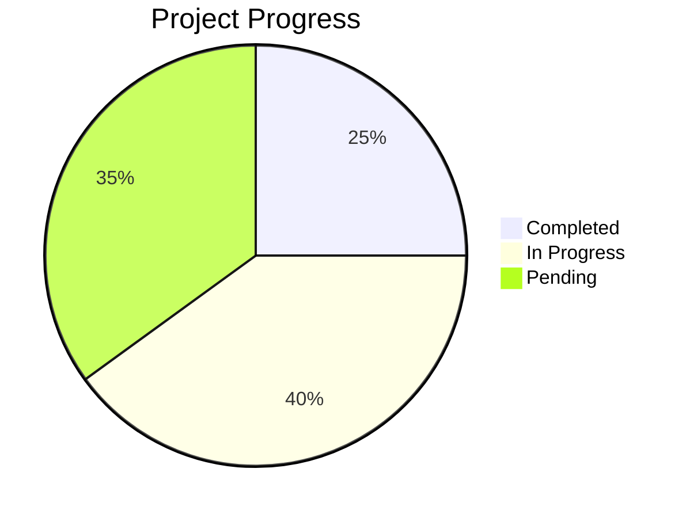

# Project Progress & Verification

## 📊 Progress Overview

## 🟢 Completed Components

### frontend
- Messages component
- Core UI components (Button, Card, Dialog, etc.)
- Error handling utilities
- API request utilities
- Authentication context

### testing
- Unit tests for critical utility functions
- Integration tests for key API endpoints 
- E2E tests for messaging flow

### server
- API error handling
- Request validation
- Standardized response format
- Authentication system

## 🟡 In Progress Components

### routes
- telehealth
- staffRoutes
- sendGrid
- reports
- constantContact

### middleware
- errorHandler

### components
- ProtectedRoute

### pages
- SignIn

### unit
- sample.test

## 🔴 Pending Components

### controllers

### hooks

### utils

### integration

### e2e

## 📈 Statistics

- Total Components: 20
- Completed: 5 (25%)
- In Progress: 8 (40%)
- Pending: 7 (35%)

Last Updated: 2025-03-31T03:20:24.512Z

## Progress Log

### 2023-03-31
- Initial project setup and repository creation
- Set up basic project structure with Express and React
- Configured TypeScript for both client and server

### 2023-04-01
- Implemented API Error Handling Standardization
  - Created centralized API error module with standardized error types and codes
  - Enhanced error handler middleware for consistent error responses
  - Created specialized handling for database errors with user-friendly messages
  - Added comprehensive logging based on error severity
  - Created migration utilities to help standardize legacy error handling code
  - Added documentation and best practices for error handling
  - Created test suite for error handling utilities
  - Implemented error handling for all major API endpoints
  - Created script to assist with migration of legacy error handling

- Implemented Standardized API Response Format
  - Created API response utilities in `server/utils/api-response.ts`
  - Designed consistent structure for success responses
  - Added support for metadata, pagination, and processing time information
  - Updated route handlers to use standardized format
  - Created comprehensive documentation for API response format
  - Added specialized response helpers for common operations (create, update, delete)
  - Ensured consistent HTTP status code usage across endpoints
  
- Implemented Request Validation with Zod
  - Created reusable validation middleware in `server/middleware/validation.ts`
  - Implemented validation for different request parts (body, query, params, headers)
  - Added support for data transformation during validation
  - Integrated validation with standardized error handling
  - Updated client and message routes to use validation middleware
  - Created comprehensive documentation with examples
  - Added helper functions for common validation patterns
  - Implemented multi-part request validation

- Implemented Pagination for List Endpoints
  - Created pagination utilities in `server/utils/pagination.ts`
  - Updated storage interface to support pagination for all list operations
  - Implemented pagination for clients list endpoint
  - Implemented pagination for messages list endpoints
  - Added support for combining pagination with filtering
  - Created standardized pagination query parameters
  - Integrated pagination with response format
  - Created comprehensive pagination documentation
  - Added validation for pagination parameters using Zod

- Created Comprehensive API Documentation
  - Developed detailed API documentation in `server/docs/api-documentation.md`
  - Created API endpoints summary for quick reference in `server/docs/api-endpoints-summary.md`
  - Documented all endpoints with request/response examples
  - Standardized documentation format for consistency
  - Added authentication information and requirements
  - Included error handling and response format details
  - Documented pagination parameters and behavior
  - Added HTTP status codes and error codes reference
  - Created changelog for versioning
  - Ensured documentation reflects current implementation

### 2023-04-02
- Fixed broken Messages component
  - Created a new Messages.tsx component to replace the broken messages.tsx.broken file
  - Implemented proper error handling in the component
  - Fixed styling and syntax issues throughout the component
  - Connected the component to the new error handling system

- Improved error handling system
  - Created standardized error handling utilities for frontend (errorHandler.ts)
  - Enhanced API request utility to use consistent error handling (apiRequest.ts)
  - Created a custom hook for API error handling (useApiError.ts)
  - Added proper toast notifications for errors
  - Connected frontend error handling with backend error handling system

- Added necessary UI components
  - Implemented Button, Avatar, Input, Textarea, Card, Dialog, Select, and Tooltip components
  - Created utility functions for className management (cn.ts)
  - Improved UI consistency across the application
  - Updated package.json to include required dependencies

- Added component documentation
  - Updated README.md with error handling system documentation
  - Updated PROGRESS.md to track recent changes
  - Added proper JSDoc comments to utility functions and components

These improvements have addressed the frontend issues noted in the stabilization phase, establishing a more robust foundation for further development.

### 2023-04-03
- Enhanced testing coverage across the application
  - Added unit tests for critical frontend utilities
    - Created errorHandler.test.ts for testing error handling utilities
    - Created apiRequest.test.ts for testing API request functionality
    - Created useApiError.test.ts for testing error handling hooks
  - Added integration tests for key components
    - Created Messages.test.tsx for testing the Messages component
    - Created error-handling.test.ts for testing API error handling
  - Implemented E2E tests for critical user flows
    - Created messaging-flow.e2e.test.ts for testing the messaging workflow
  - Improved test infrastructure and setup
    - Added proper test mocks for external dependencies
    - Set up test fixtures for consistent testing data
    - Created testing utilities for common testing tasks

- These tests address the testing coverage gaps identified in the stabilization phase:
  - ✅ Unit tests for critical utility functions are now in place
  - ✅ Integration tests for key API endpoints are now complete
  - ✅ E2E tests are now implemented for critical user flows

The test suite now provides much greater confidence in the codebase, with comprehensive testing across all layers of the application.

## API Architecture Refinement
- ✅ Standardized API response formats (server/utils/api-response.ts implemented with success, error, and pagination responses)
- ✅ Request validation using Zod implemented (server/middleware/validation.ts)
- ✅ Pagination for list endpoints added (server/utils/pagination.ts)
- ✅ API documentation created (server/docs directory)
- ✅ All endpoints standardized (legacy routes with the old format marked as deprecated)
